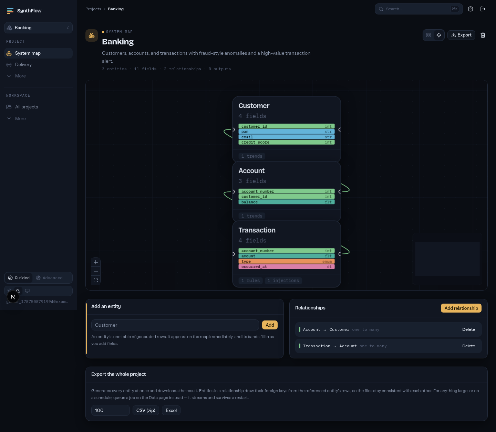
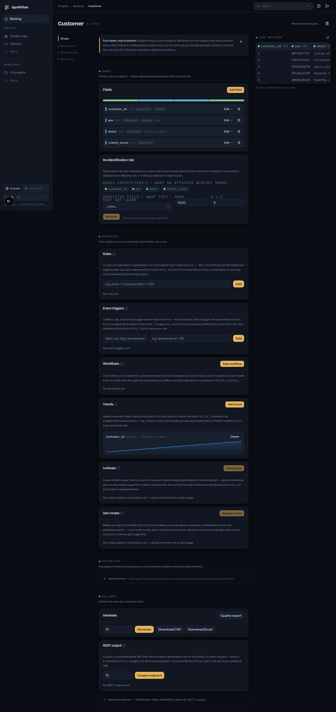
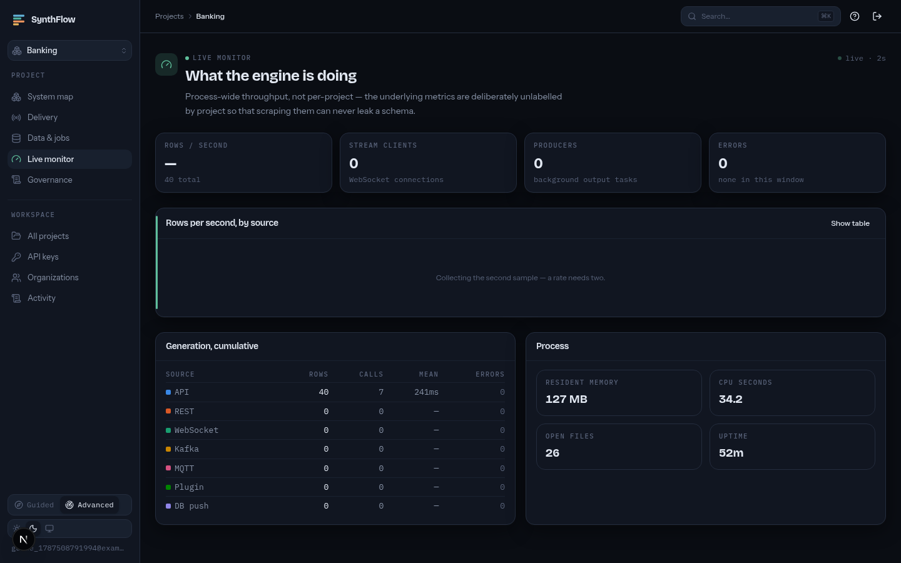
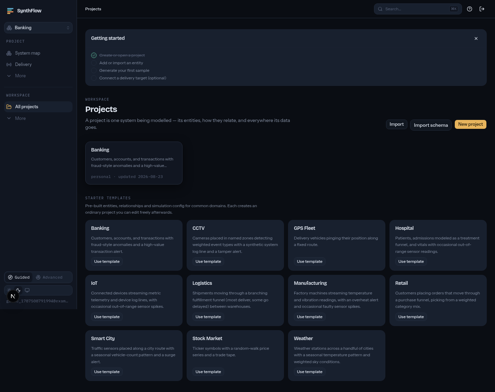

# SynthFlow

**Open-source synthetic data simulation platform.**
Design realistic data. Simulate real-world behavior. Deliver it anywhere.

---

## Why SynthFlow

Most "fake data" tools generate isolated, static records. Real systems need data
that *behaves* — entities with state, relationships that hold together, rules that
fire under conditions, and streams that look and feel like production traffic.

Teams end up hand-rolling one-off scripts to fill that gap, and those scripts rot.

SynthFlow is a configurable simulation platform for modeling entire systems —
schemas, relationships, business rules, workflows, and time-based behavior — and
publishing the result through APIs, databases, message brokers, or files.

AI is completely optional. SynthFlow works fully offline with zero LLM calls; if you
want it, you bring your own key (OpenAI, Claude, Gemini, Mistral, Groq, OpenRouter,
Ollama, LM Studio, or any OpenAI-compatible endpoint).

## What it does

- **Visual schema builder** — entities, field types, constraints, formulas, foreign keys
- **Relationship builder** — one-to-one, one-to-many, many-to-many, parent-child
- **Stateful entities** — records that move through defined state transitions, not
  random rows (e.g. `Created → Packed → Shipped → Delivered`)
- **Workflow / state machine builder** — visual state machines for IoT, manufacturing,
  logistics, robotics
- **Rules engine** — logical, mathematical, conditional, and cross-entity rules
- **Formula engine** — derived fields computed automatically (`Total = Price × Quantity`)
- **Simulation engine** — batch generation, live streaming, time acceleration,
  peak-hour/holiday schedules, infinite streams
- **Trend, correlation, and probability engines** — seasonal/cyclic/random-walk trends,
  correlated signals (temperature ↑ → humidity ↓), weighted distributions
- **Event triggers & error injection** — threshold-based events, missing values,
  corrupted payloads, out-of-order and delayed events, timeouts
- **Timeline replay** — replay historical datasets as live streams at any speed
- **Domain simulators** — geographic/GPS, user behavior, API responses, logs
  (Kubernetes/Docker/Nginx), and security events
- **Digital twin modeling** — compose interacting subsystems (e.g. a factory: machines,
  sensors, workers, maintenance, alarms) into one simulation
- **Templates** — ready-made projects for banking, stock market, smart city, weather,
  hospital, manufacturing, CCTV, logistics, GPS fleet, retail, IoT
- **Live monitoring** — events/sec, active streams, resource usage, error rates

## Architecture

```
Next.js UI
   │
FastAPI Backend
   │
   ├── Schema Engine
   ├── Rules Engine
   ├── Workflow Engine
   │
   Simulation Engine
   │
   Plugin Manager
   │
   ├── REST        ├── Kafka       ├── MQTT
   ├── WebSocket    ├── PostgreSQL  ├── CSV/JSON
```

Everything past the core is a plugin. Install only what you need — a REST-only
deployment doesn't pull in Kafka, MongoDB, or MQTT dependencies.

## Tech stack

| Layer | Choices |
|---|---|
| Frontend | Next.js, React, TypeScript, Tailwind CSS, shadcn/ui, React Flow, TanStack Query, Zustand, React Hook Form, Monaco Editor, Recharts |
| Backend | FastAPI, SQLAlchemy, Pydantic, Uvicorn |
| Database | PostgreSQL, SQLite |
| Synthetic data | Faker, Mimesis, Polyfactory |
| Streaming | Kafka, MQTT, RabbitMQ, WebSockets |
| Background jobs | Postgres-backed queue (`SELECT … FOR UPDATE SKIP LOCKED`) |
| Monitoring | Prometheus, Grafana, Loki |
| Auth | JWT |
| Containers | Docker, Docker Compose |

## Project status

**Phases 1–5 and 7–14 are live**, backend and frontend, each verified end to
end rather than only by test suite:

- **1–2** core platform, relationships, rules, formulas, stateful workflows
- **3** outputs: CSV/JSON/Excel, PostgreSQL push, REST, WebSocket, Kafka, MQTT
- **4** advanced simulation: trends, probability, error injection, lookup
  tables, event triggers, timeline replay, geo routes, log/security presets
- **5** extensibility: generator/rule-function/output plugins, project
  export–import, 11 starter templates, a monitoring dashboard, modular install
- **7** schema import — build a project from a live database, SQL dump,
  JSON Schema/OpenAPI, or a sample file
- **8** scale: streaming generation with no memory ceiling, a Postgres-backed
  job queue with progress and cancellation, cron schedules, and background
  producers that survive a restart
- **9** learn from real data: upload sample files and get fitted distributions,
  observed category frequencies, per-column missing-value rates, correlations
  between columns and relationships between files — as an ordinary editable
  project, using statistics rather than a language model
- **10** privacy: personal data detected and replaced with synthetic
  generators during profiling (so no value from your file reaches the
  project), k-anonymity and l-diversity measured on generated output, and
  connection passwords encrypted at rest
- **11** data quality: a report on what was actually generated — what the
  engine discarded, where output contradicts its own field definitions, and
  your own assertions — in the browser and as `synthflow check`, which exits
  non-zero so it works as a CI gate
- **12** connectors, in both directions: MySQL and MongoDB push alongside
  PostgreSQL, S3-compatible object storage (AWS S3, MinIO, R2, Spaces, B2),
  Parquet/ORC/Avro job formats, RabbitMQ and a signed webhook — and matching
  *input* connectors, so profiling can learn from a URL, a bucket object, or
  a database table. Each is an optional extra, so an install only carries the
  drivers it uses. Reading a table keeps its real column types, which a CSV
  export would flatten to strings. Warehouses (ClickHouse, Snowflake,
  BigQuery) are the one bullet not done.
- **13** temporal continuity: a **record store** keeps an entity's records
  between generation calls, so the same customer exists tomorrow and can
  receive new orders. Trends and geo routes continue from where the last call
  stopped instead of replaying. A per-store **change log** records inserts,
  updates and deletes with `before`/`after` for a CDC consumer to read from a
  cursor, slowly-changing-dimension type 1 and 2 make the store a queryable
  dimension table, and a **backfill** produces a historical window that live
  generation then continues from. `many_to_many` finally emits a real join
  table.

- **14** teams and governance: **API keys** so CI can call SynthFlow at all
  (read-only or full, revocable, shown once), **organizations** with a
  viewer/member/admin/owner role ladder and projects shared into them, an
  **audit log** of every change and who made it — derived from the request,
  so nothing can be forgotten — **single sign-on over OIDC**, and **project
  version history** with a structural diff and a rollback that snapshots
  what it replaced. SAML is deliberately not implemented; see the roadmap.

Phase 6 (the optional AI layer) is deliberately unstarted — nothing depends
on it. Phases 15–16 are planned.

## Getting started

```bash
git clone https://github.com/Abhi-shekes/synthflow.git
cd synthflow
docker compose up -d --build
docker compose exec backend alembic upgrade head
```

- Frontend: [http://localhost:3000](http://localhost:3000)
- Backend API: [http://localhost:8001](http://localhost:8001) (interactive docs at `/docs`)

New to the app? [`docs/USER_GUIDE.md`](docs/USER_GUIDE.md) is a
screenshot-by-screenshot walkthrough of every page — signing in, the
welcome flow, the system map, designing an entity, Guided vs. Advanced
mode, and everything in the workspace settings. A few pages, to give you
the shape of it:

<table>
<tr>
<td width="50%">

**The system map** — every entity, how they relate, and where their data
goes, in one place.



</td>
<td width="50%">

**Designing an entity** — fields, formulas, and delivery, in Guided mode.



</td>
</tr>
<tr>
<td width="50%">

**Live monitor** — events/sec, active streams, resource usage, error
rates.



</td>
<td width="50%">

**Starter templates** — twelve ready-made domains to explore or build
from.



</td>
</tr>
</table>

The full guide covers signing in, governance, API keys, the command
palette, and both themes.

### Optional services

Extras are behind Compose profiles, so the default `docker compose up`
stays a three-container stack. Either pick them with the wizard:

```bash
synthflow init                              # interactive
synthflow init --services kafka,monitoring --yes   # or not
docker compose build backend && docker compose up -d
```

`synthflow init` writes a single `.env` with `COMPOSE_PROFILES` (which
services start) and `SYNTHFLOW_EXTRAS` (which optional Python
dependencies go into the backend image). That second one is what makes
the install genuinely modular — a Kafka-only install never pulls
`aiomqtt` at all, and the UI greys out the MQTT output and tells you how
to enable it.

Or turn profiles on directly, without the wizard:

```bash
docker compose --profile monitoring up -d   # Prometheus + Grafana + Loki
docker compose --profile kafka up -d        # Redpanda, for Kafka outputs
docker compose --profile mqtt up -d         # Mosquitto, for MQTT outputs
docker compose --profile mysql up -d        # a MySQL server to push into
docker compose --profile mongo up -d        # a MongoDB server to push into
```

The `mysql` and `mongo` profiles start throwaway *push targets* — servers
SynthFlow writes into, not part of SynthFlow itself. They use non-default
host ports (3307 and 27117) so they don't collide with a database you
already run locally.

With the `monitoring` profile up, Grafana is at
[http://localhost:3001](http://localhost:3001) — no login, already
provisioned with a **SynthFlow overview** dashboard showing rows/sec by
source, active producers and connected clients, backend CPU/memory,
generation latency, and errors. The backend exposes raw metrics at
`/metrics` and container logs land in Loki.

See `backend/README.md` and `frontend/README.md` for running each service
without Docker.

## Contributing

This project is just getting started and is open to contributors. See
[CONTRIBUTING.md](CONTRIBUTING.md).

## License

[MIT](LICENSE)
