# SynthFlow — Visual User Guide

A screenshot-by-screenshot walkthrough of every part of the app, for anyone
opening SynthFlow for the first time.

Every screenshot here was taken against a real, running instance of the app
(not mocked up), on the account setup described in each step, so what you
see is what you'll get.

## Contents

1. [Signing in and creating an account](#1-signing-in-and-creating-an-account)
2. [The welcome flow — starting your first project](#2-the-welcome-flow--starting-your-first-project)
3. [The system map](#3-the-system-map)
4. [The Projects page and the getting-started checklist](#4-the-projects-page-and-the-getting-started-checklist)
5. [Designing an entity](#5-designing-an-entity)
6. [Guided mode vs. Advanced mode](#6-guided-mode-vs-advanced-mode)
7. [Data & jobs](#7-data--jobs)
8. [Delivery](#8-delivery)
9. [Live monitor](#9-live-monitor)
10. [Governance](#10-governance)
11. [Workspace settings](#11-workspace-settings)
12. [Getting help without leaving the page](#12-getting-help-without-leaving-the-page)
13. [Light and dark theme](#13-light-and-dark-theme)

---

## 1. Signing in and creating an account

**Sign in**, if you already have an account:

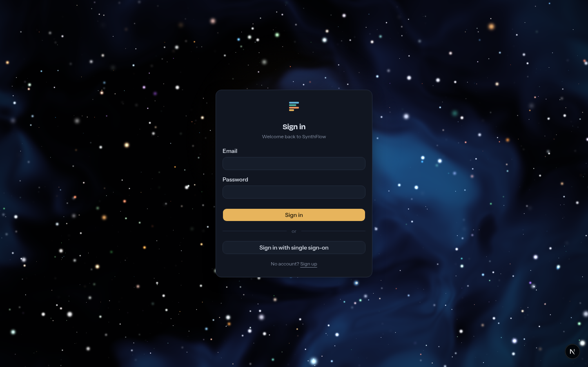

**Sign up**, if you don't:

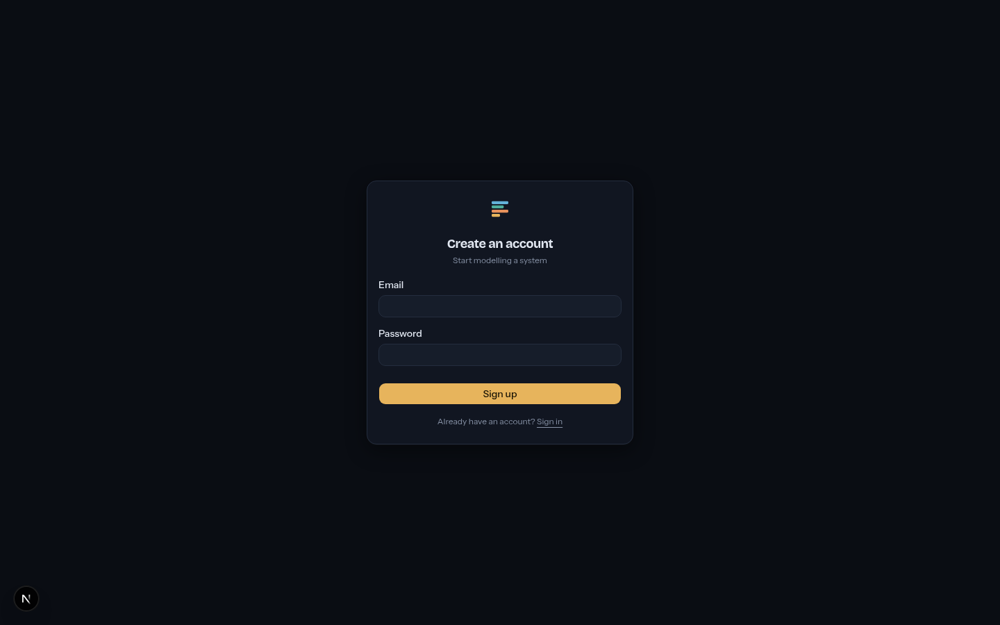

- Enter an email and a password (8+ characters) and click **Sign up**.
- If your organization has single sign-on configured, a **Sign in with
  single sign-on** button appears automatically on the sign-in page — you
  don't need to do anything to enable it.
- A brand-new account always lands on the welcome flow next, not an empty
  dashboard — see the next section.

---

## 2. The welcome flow — starting your first project

The first thing a new account sees. Three ways to start, side by side —
pick whichever matches what you're doing, there's no wrong answer and you
can always change course later.

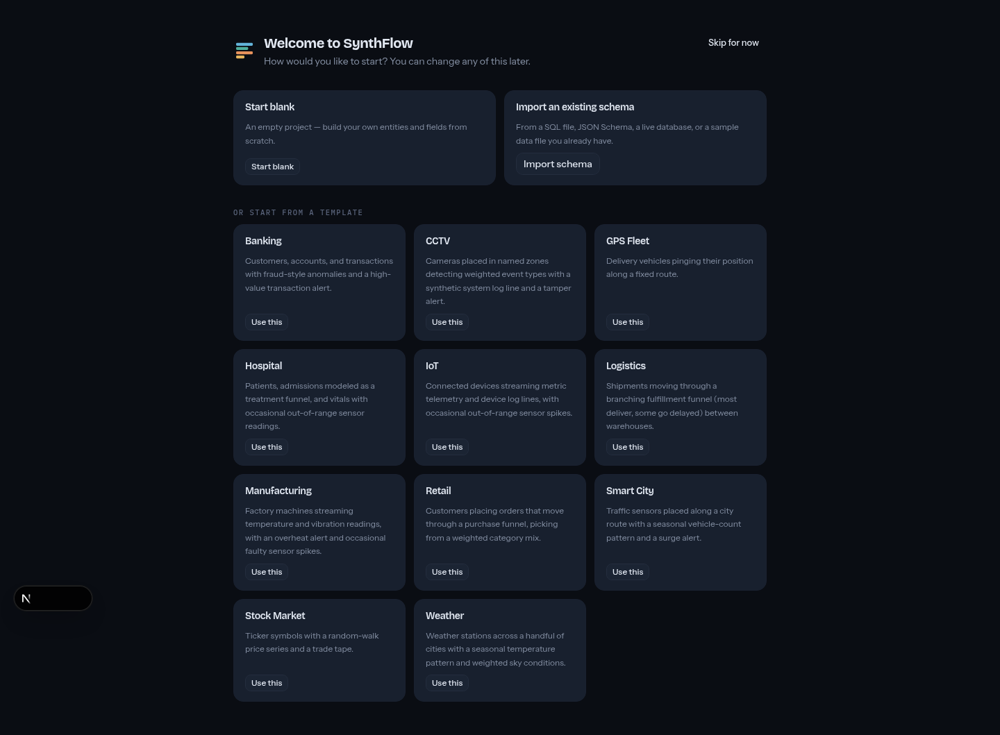

- **Start blank** — an empty project. Good if you already know the entities
  you want and would rather build them yourself.
- **Import an existing schema** — from a SQL file, a JSON Schema document, a
  live database connection, or a sample data file (CSV/Excel/JSON). Good if
  you're modelling something that already exists.
- **Use a starter template** — twelve ready-made domains (Banking, CCTV,
  GPS Fleet, Hospital, IoT, Logistics, Manufacturing, Retail, Smart City,
  Stock Market, Weather) each pre-populated with realistic entities,
  relationships, and simulation config. Good for exploring what the product
  can do, or as a base to edit into what you actually need. This guide uses
  the **Banking** template throughout.
- **Skip for now**, top right, if you'd rather see an empty `/projects`
  page and decide later.

Whichever you pick, you land straight inside that project.

---

## 3. The system map

The home page of every project — your entities, how they relate, and
where their data goes, all in one place. It has two views.

**List view** (the default for new accounts) — simple, scannable, and what
you'll usually want while you're still getting oriented:

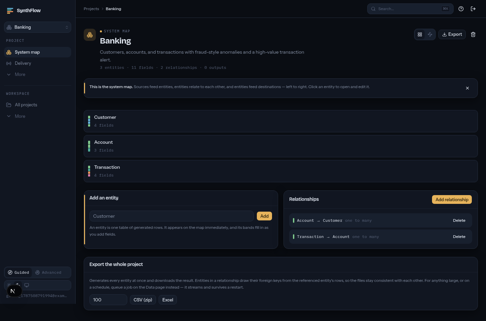

The banner at the top ("**This is the system map.**") only appears the
first time you visit — dismiss it with the **×** and it won't come back.

**Canvas view** — a pan/zoom diagram of the same information, with each
entity drawn as a "core sample": a stack of coloured bands, one per field,
so you can read an entity's shape at a glance without opening it:

- Switch between the two with the toggle at the top right of the page (the
  grid/waypoints icon pair).
- **Click any entity** — in either view — to open it and start editing.
- Use **Add an entity** (bottom left) to create a new one, and
  **Add relationship** (bottom right) to connect two entities together.
- **Export** downloads the whole project's schema as a portable file you
  can re-import elsewhere.

---

## 4. The Projects page and the getting-started checklist

`/projects` lists everything you own or have been shared. A first-time
account sees a **Getting started** checklist at the top — a short, honest
progress tracker, not a gate:

- The checklist ticks off automatically as you do things elsewhere in the
  app (create a project, add an entity, generate a sample, connect a
  delivery target). Dismiss it with the **×** any time — it won't come back
  once dismissed.
- **New project** creates an empty one. **Import** loads a project file
  someone exported earlier. **Import schema** opens the same SQL/JSON
  Schema/database/sample-file import used in the welcome flow.
- Every starter template is also available here, any time — not just
  during your first session.

---

## 5. Designing an entity

Click into any entity and you get the **Strata Inspector** — everything
about that entity, organized into four layers in the order data actually
moves through the engine: **Shape → Behaviour → Distortion → Delivery**.

A few things worth noticing immediately:

- **Shape** is always open — it's the one layer every entity needs. Add
  fields, set their type, and mark them required/unique/nullable from here.
- The **live specimen**, top right, regenerates automatically as you edit —
  change a field and watch real sample rows update, without ever clicking
  Generate.
- **Behaviour** and **Distortion** start collapsed to a one-line summary if
  they're empty — click **Add behaviour** / **Add distortion** to expand
  them. (If a starter template already configured rules or trends for you,
  that layer opens automatically — nothing pre-built ever hides.)
- Small **ⓘ** icons next to jargon (like *Quasi-identifiers* or *k ≥*)
  open a plain-language definition on click:

  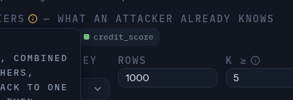

Scroll down (or click **Behaviour** in the left rail) to reach rules, event
triggers, workflows, trends, lookups, and geo routes:

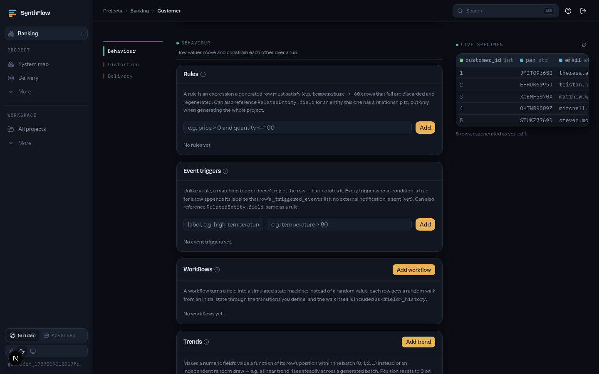

- **Rules** reject any generated row that doesn't satisfy a condition you
  write (e.g. `age >= 18`).
- **Trends** make a numeric field follow a shape over time (rising,
  cycling, drifting) instead of being purely random — the little chart
  under each trend shows you the curve before you commit to it.
- Everything here is optional. Shape is the only required layer.

Keep scrolling to **Delivery** — where the entity's rows can go. REST and
the **Generate** panel are visible immediately; the other six protocols
(WebSocket, Kafka, RabbitMQ, webhook, MQTT, plugin) are one click away
behind **Advanced delivery**, so the common case (download a file or hit a
REST endpoint) isn't buried under six things most people won't use today:

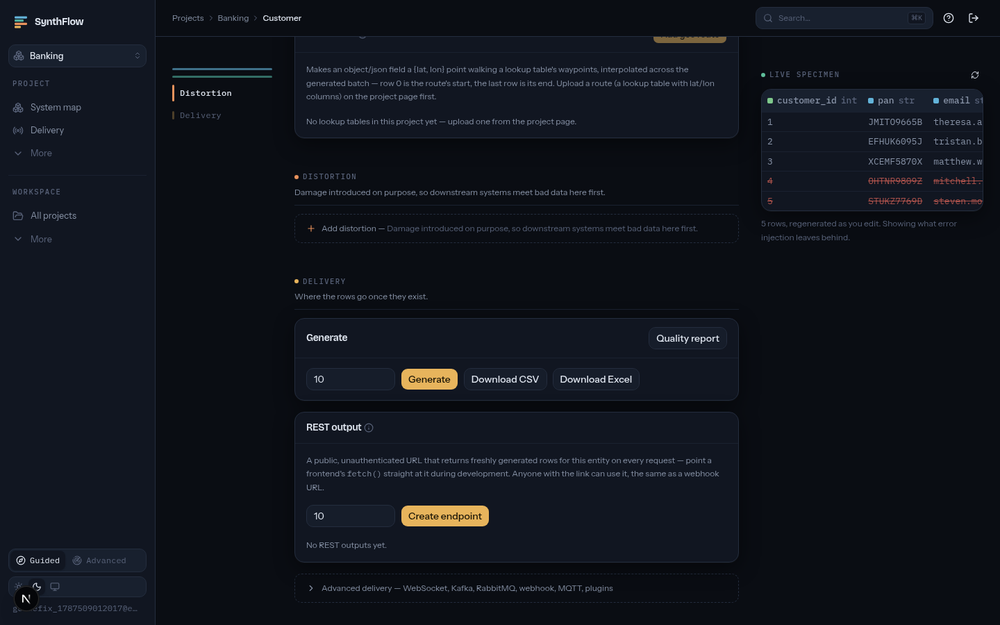

Click **Generate** to produce rows on demand and see them in a table right
on the page — this also feeds the **Download CSV** / **Download Excel**
buttons next to it:

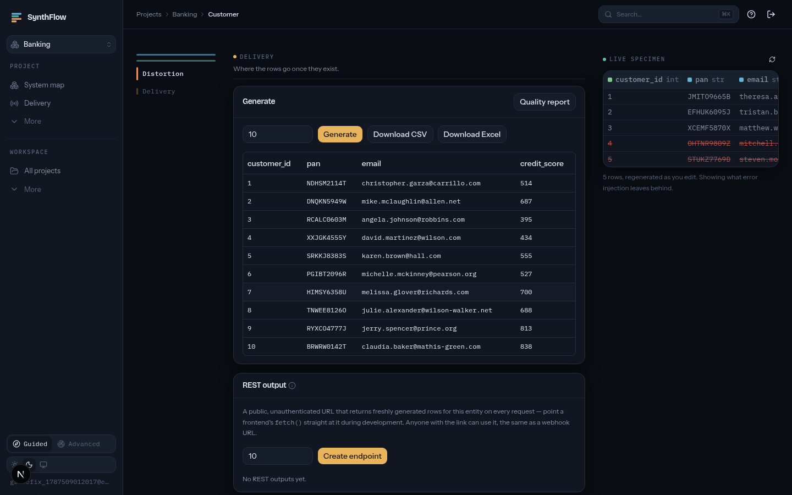

Notice the **live specimen** on the right in that last screenshot: two rows
are struck through in red. That's **Distortion** — deliberately corrupted
rows — visibly changing the sample data in real time as you scroll near it,
so you can see exactly what "bad data" will look like before it ever
reaches a system downstream of yours.

---

## 6. Guided mode vs. Advanced mode

Every new account starts in **Guided** mode — the collapsed
Behaviour/Distortion layers and the simplified Delivery view you just saw
above are what that mode looks like. Nothing is ever deleted or locked
behind it; everything is one click away.

The same entity page, scrolled to the top, in Guided mode:

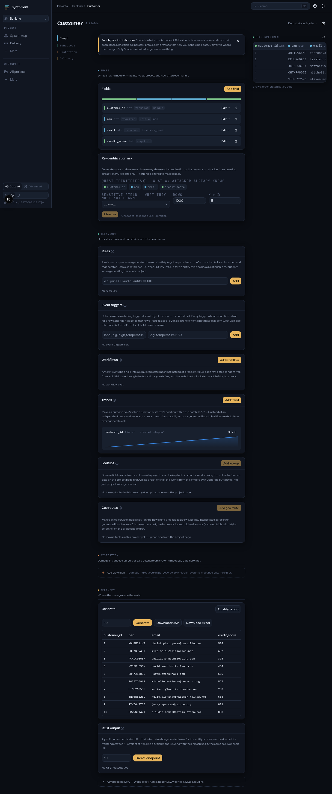

Flip the toggle in the left rail (bottom, labelled **Guided / Advanced**)
and the same page shows every layer fully expanded, every delivery
protocol visible at once, and the rail gains **Data & jobs**, **Live
monitor**, and **Governance** as permanent entries instead of one click
behind **More**:

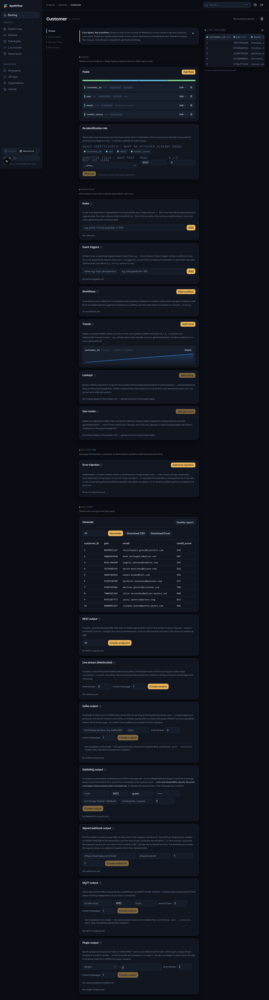

- Switch back and forth freely — your choice is remembered across sessions
  and devices, but never changes what you can actually do, only what's
  visible by default.
- If you're new to SynthFlow, stay in Guided mode until the basic
  vocabulary (entity, field, generate) feels familiar. If you already know
  what Kafka topics and webhook signing look like, switch to Advanced and
  stay there.

---

## 7. Data & jobs

Everything about *running* generation, rather than *designing* the schema:
background jobs, schedules, record stores (for data that needs to persist
between calls), reference/lookup tables, and connections to external
databases or object storage.

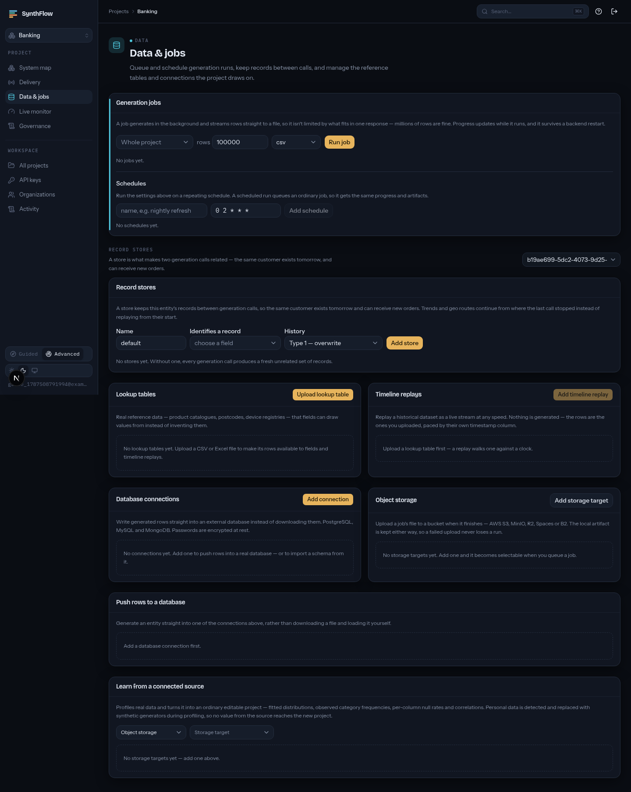

- **Generation jobs** run in the background and stream rows straight to a
  file — use this instead of the entity page's Generate button when you
  want millions of rows or a scheduled recurring run.
- **Record stores** are what make two separate generation calls related to
  each other — e.g. so "customer #42" still exists and can place a second
  order tomorrow, instead of every call producing an unrelated fresh batch.
- **Database connections** let you write generated rows straight into a
  real Postgres/MySQL/MongoDB database instead of downloading a file.

---

## 8. Delivery

The project-wide, read-only view of every output configured on every
entity — "where does this project's data actually go?" answered in one
place instead of opening each entity in turn.

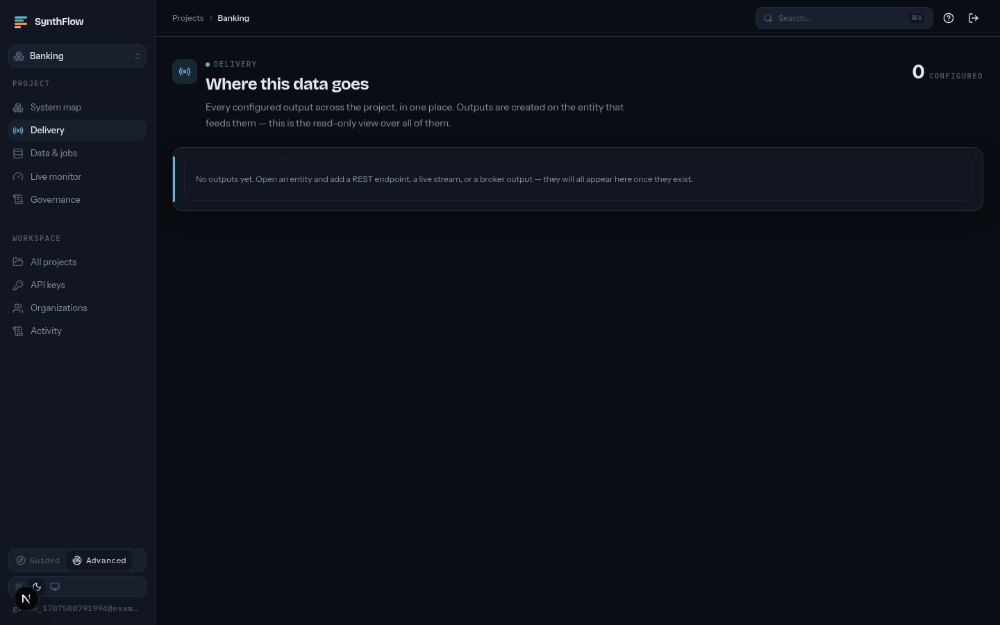

This project has no outputs configured yet, so it shows the empty state —
once you add a REST endpoint or a Kafka topic on any entity (see
[§5](#5-designing-an-entity)), it appears here automatically, grouped by
kind.

---

## 9. Live monitor

Real-time throughput for the whole running system — rows per second, active
stream clients, background producers, and error rates, updating every couple
of seconds without a page refresh.

- The numbers here are **process-wide**, not scoped to one project — the
  underlying metrics are deliberately kept unlabelled by project so that
  scraping them can never leak a schema.
- **Generation, cumulative** breaks totals down by source (API, REST,
  WebSocket, Kafka, MQTT, plugin, direct database push) since the process
  started.
- **Process** shows resident memory, CPU time, open file handles, and
  uptime — useful for noticing a leak or a stuck producer before it becomes
  an incident.

---

## 10. Governance

Who can see this project, what changed, and how to get back to an earlier
design if a change goes wrong — the three controls you reach for when
something's gone wrong live together here, not scattered across the app.

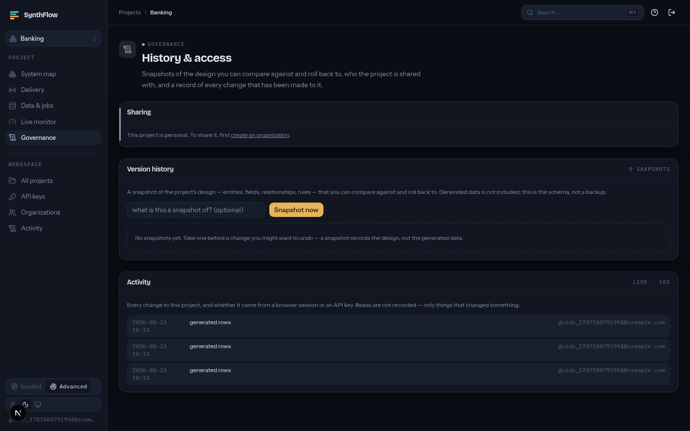

- **Sharing** — a project is personal until you explicitly share it into an
  organization. Sharing it doesn't change anything about how it behaves,
  only who else can see and edit it.
- **Version history** — a snapshot of the project's *design* (entities,
  fields, relationships, rules) that you can compare against or roll back
  to. This is not a backup of generated data, only of the schema.
- **Activity** — every change made to this project, and whether it came
  from a browser session or an API key. Only things that actually changed
  something are recorded — reads never show up here.

---

## 11. Workspace settings

Three pages that live outside any one project, reached from the
**Workspace** section of the left rail.

**API keys** — credentials for calling SynthFlow's own API from a script or
CI job, instead of signing in as a person every time:

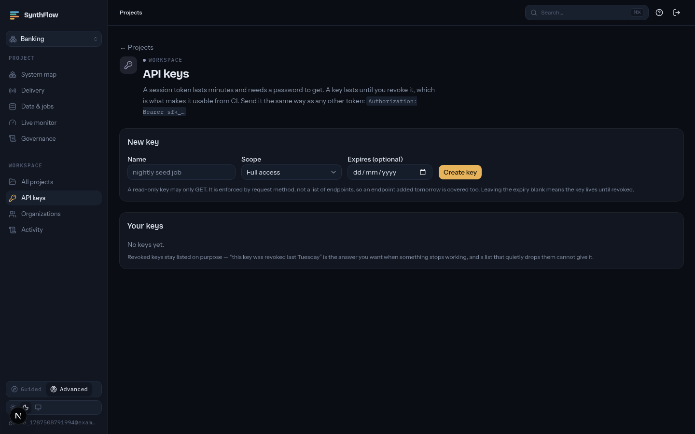

**Organizations** — shared workspaces. A project stays personal until you
put it in one:

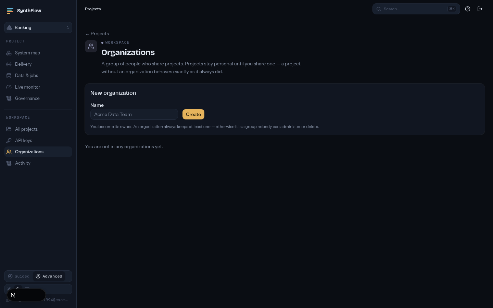

**Activity** — the same audit log as a project's Governance page, but
across every project you can see, not just one:

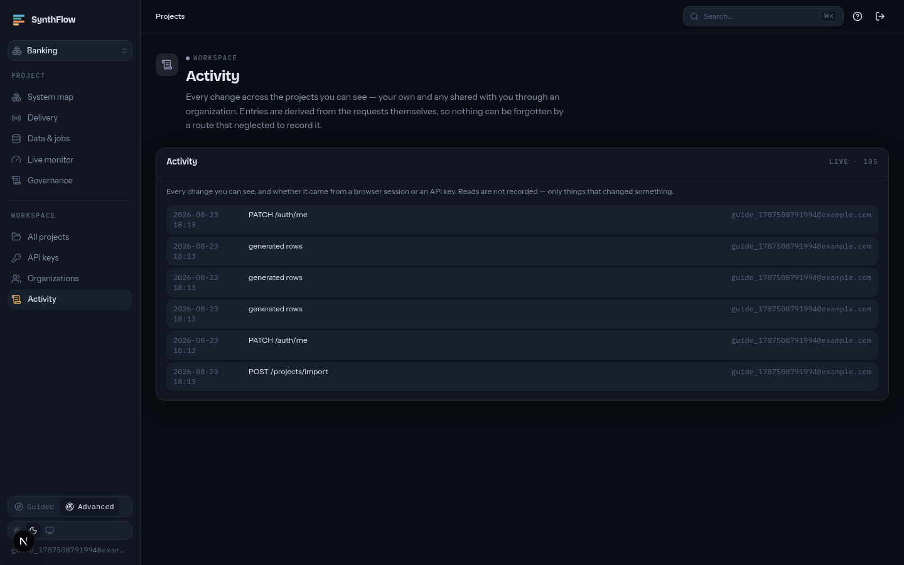

---

## 12. Getting help without leaving the page

Click the **?** icon in the header, on any page, for a short explanation of
what that page is for and the two or three things people usually do there —
plus definitions for any jargon specific to it:

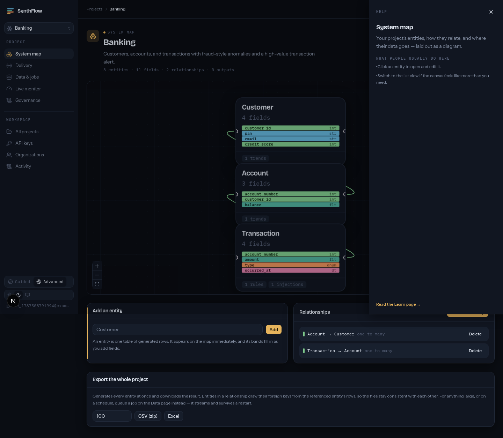

For a fuller reference — every page explained, plus every piece of jargon in
the product (rule, trend, k-anonymity, REST vs. Kafka vs. MQTT, and so on)
with a one-line plain-language definition and an example — click
**Read the Learn page** at the bottom of that panel, or go to `/learn`
directly:

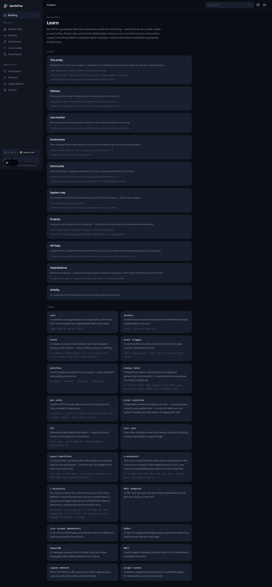

And for fast navigation once you know the app a little, press **⌘K**
(**Ctrl+K** on Windows/Linux) anywhere to search projects, pages, entities,
and fields by name:

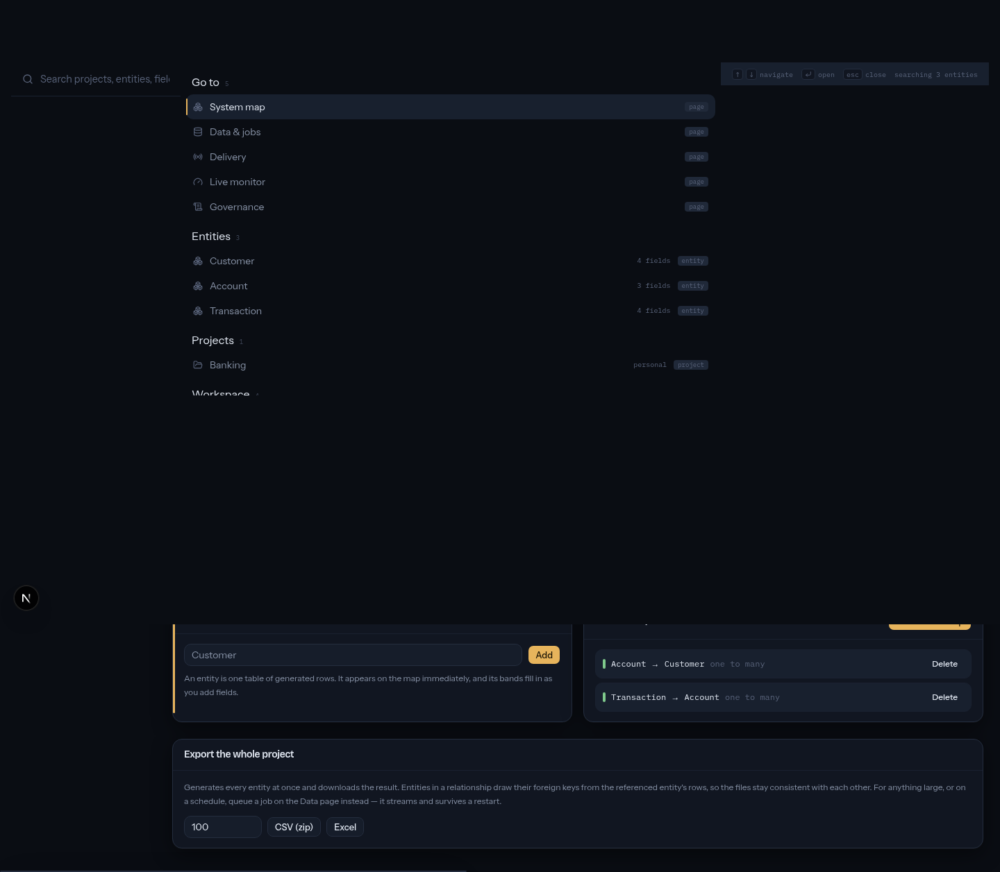

---

## 13. Light and dark theme

SynthFlow defaults to dark, but light is a fully designed second theme, not
an inverted afterthought — switch any time with the sun/moon/monitor toggle
under the mode switch in the left rail (**Monitor** follows your OS
setting).

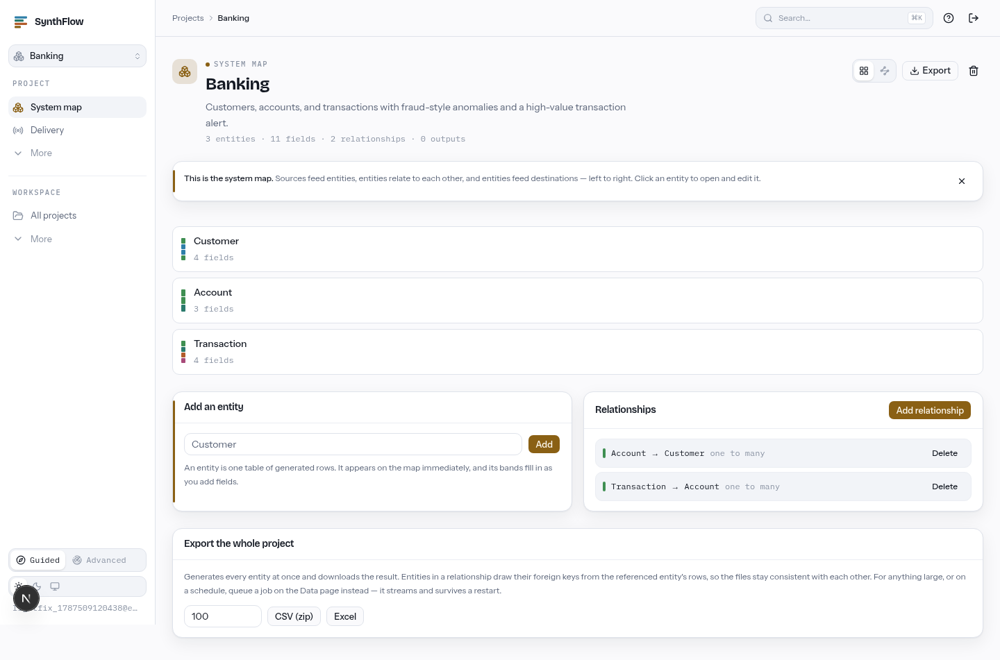

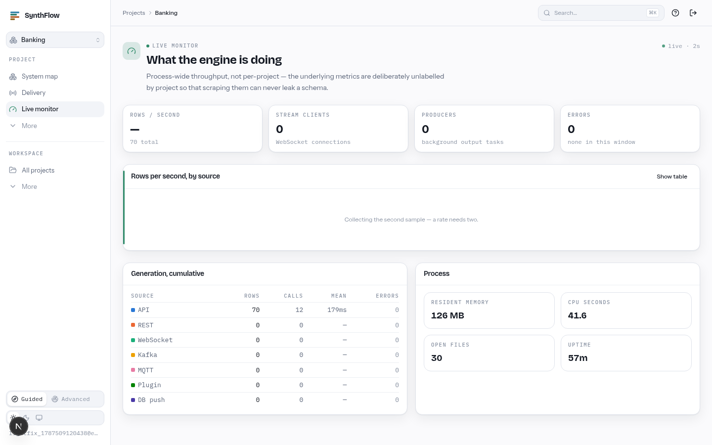

---

*Screenshots throughout this guide were captured against a Banking-template
project on a freshly created account, at 1440×900, in both themes. If
something in your own instance looks different, it's most likely because
your account, project, or mode (Guided/Advanced) differs from the one shown
— everything above is still where it says it is.*
